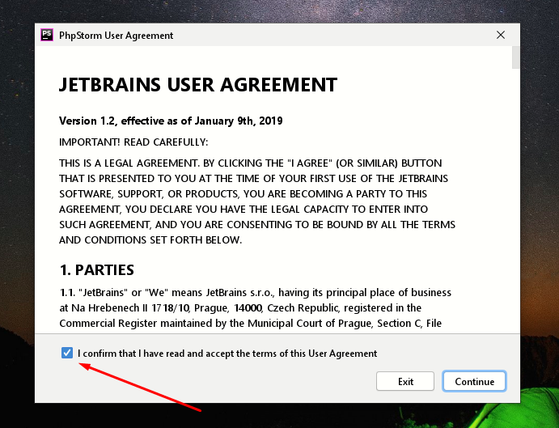
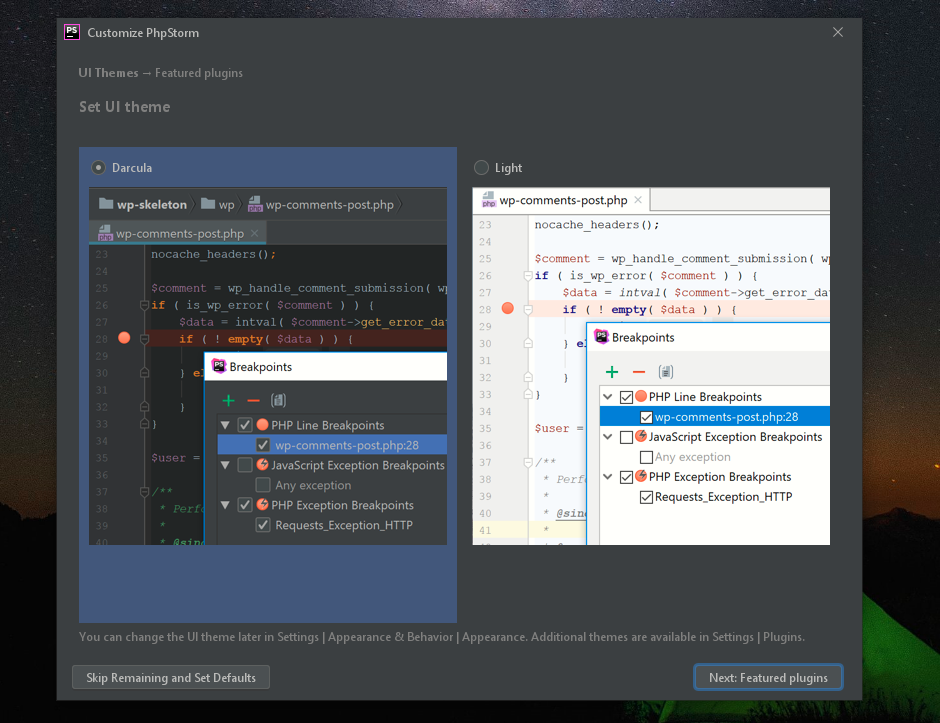
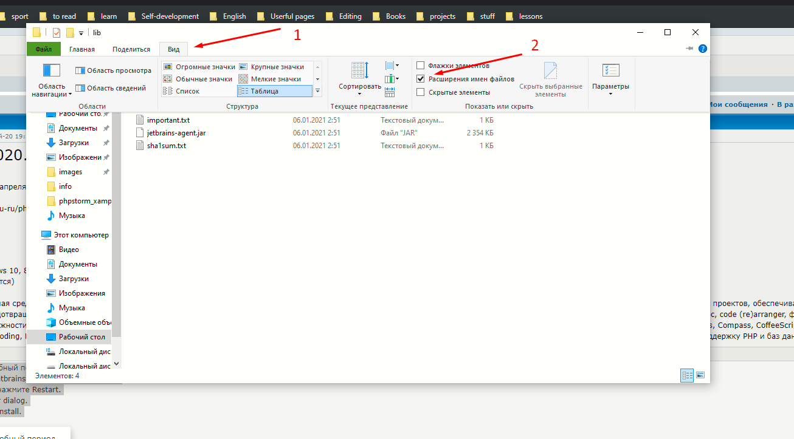
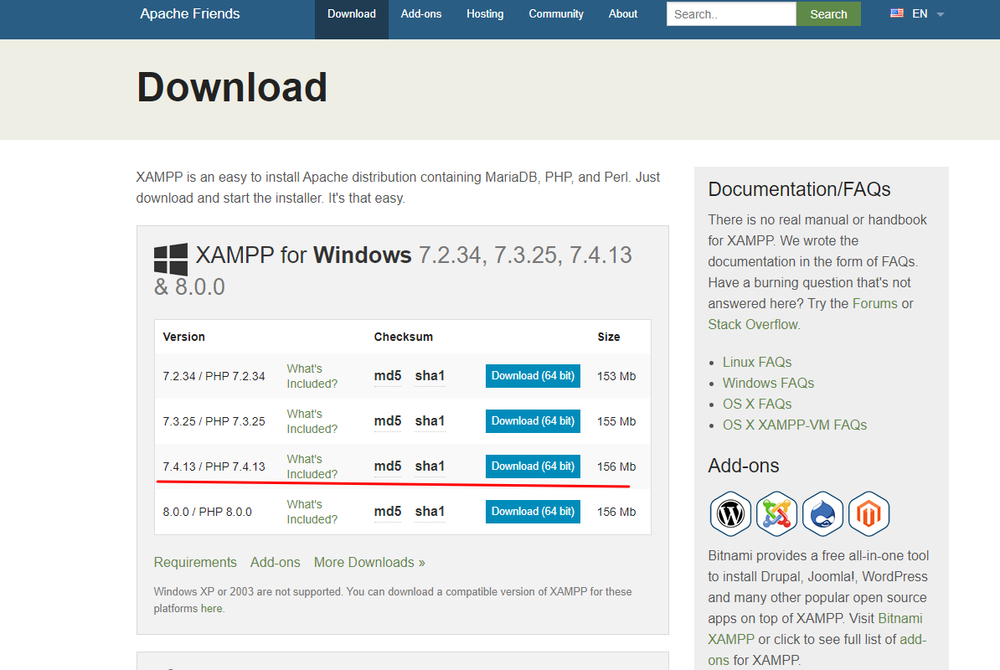

# Установка PhpStorm и XAMPP на  Windows
 
## PhpStorm платный и по этому мы скачаем его с лечением

* [Google Drive](https://drive.google.com/file/u/1/d/1xJkMUbqEn2lNlwRGgP_4wDHquyO3fbSd/view)
* [Torrent](https://rutracker.net/forum/viewtopic.php?t=5882371)
* [Official](https://www.jetbrains.com/phpstorm/download/#section=windows)

### При установке

* Соглашаемся

* Выбираем тему, я люблю черный

### Как воспользоватся лечением?

1. Запустите IDE и согласитесь на пробный период.
2. Перетащите из папки Лечение\lib\jetbrains-agent.jar на форму IDE (IDE - это редактор кода, в нашем случае PhpStorm).
   * Если не видно расширение .jar
   
3. Появится окно установки плагина, нажмите Restart.
4. Появится окно JetbrainsAgent Helper dialog.
5. Выберете тип лицензии и нажмите install.
6. Перезапустите IDE, все.

## XAMPP

* [Link to Download](https://www.apachefriends.org/download.html)
* Скачиваем версию 7.4 
  
  
* Скачиваем все по умолчанию

* НЕ ЗАБУДЬТЕ ПУТЬ, КУДА УСТАНОВИЛИ ЕГО